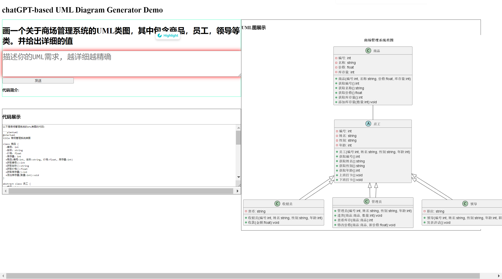
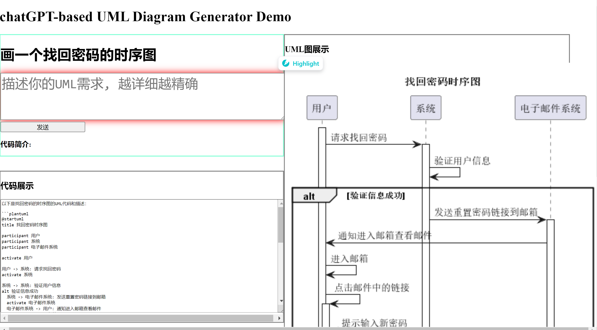

# Intro
本项目是AI画图的Demo演示，主要是使用openAI输出UML语法，+ PlantUML进行实现画图， flask负责web服务。
目前已停止更新本项目，主要是由于Flask的轻量级框架，无法支持大量的并发请求，所以本项目已经无法使用。
目前正在使用Java Spring重现本项目，后续可能会更新新的项目地址。




# Usage
当用户输入一段文字，点击提交后，会调用openAI的API，返回一段UML语法，然后将UML语法传递给PlantUML，生成图片，最后将图片展示在页面上。

# Deployment
- install python3.6
- install flask
- install openai
- 在interface.py中修改openai的key 即可运行。

# PlantUML Usage
使用以下代码即可将UML语法转换为图片
```shell
java -Djava.awt.headless=true -Dsun.java2d.uiScale=1.0 -Dsun.java2d.dpiaware=false -Dsun.java2d.noddraw=true -jar plantuml.jar dia2.txt
-t png -o /path/to/output/dir
```